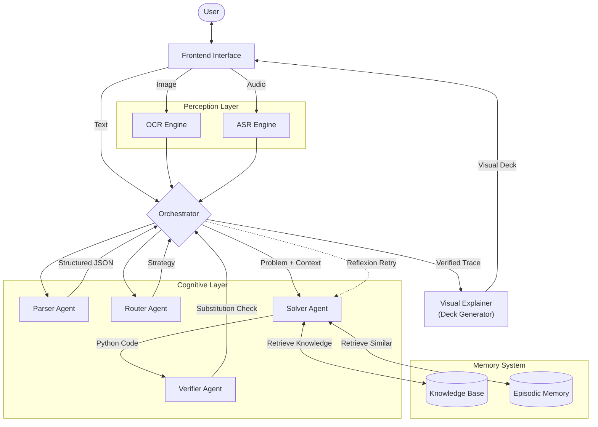

# Math Mentor: logical-reasoning-agent
A deterministic, multi-agent system for robust mathematical problem solving.

## Project Overview

Math Mentor is an autonomous reasoning system designed to solve high-school and undergraduate level mathematics problems with high reliability. Unlike varied "chat" interfaces, this application decouples semantic understanding from deterministic computation.

The system accepts multimodal inputs (text, image, audio) and employs a Human-in-the-Loop (HITL) workflow to handle ambiguity before it propagates to the solver.

## Core Philosophy

1.  **Separation of Concerns**: LLMs are excellent at planning and translation but poor at arithmetic. This system uses Gemini 2.0 Flash solely for semantic understanding and code generation, while deterministic solvers handle computation.
2.  **Reflexion**: A unified Orchestrator manages a feedback loop where failures in solution verification trigger immediate introspection and strategy adjustment, rather than silent failure.
3.  **Episodic Memory**: The system persists successful solution patterns. When faced with a new problem, it retrieves semantically similar past successes to guide its current strategy (Self-Learning).

## System Architecture

The application is structured as a pipeline of specialized agents coordinated by a central Orchestrator.

### 1. Input Processing Layer
*   **OCR Engine**: Uses Google Gemini Vision (Program-of-Thought prompting) to transcribe mathematical images into structured text. Includes transparency handling and contrast optimization.
*   **ASR Engine**: Uses Google Cloud Speech-to-Text v2 (Chirp 2) to transcribe spoken mathematical queries with state-of-the-art accuracy, converting natural speech into formal problem statements.

### 2. Cognitive Layer (The Agents)
*   **Parser Agent**: Normalizes raw input into a structured schema, identifying variables, constraints, and specifically "what needs to be solved". Flags ambiguous input for user clarification.
*   **Router Agent**: Classifies intent (e.g., Algebra, Probability, Calculus) to select the optimal solving strategy and filter the knowledge base.
*   **Solver Agent**: The core reasoning engine. It adopts a "Program-of-Thought" approach, generating SymPy code to solve problems deterministically. It integrates RAG to access mathematical laws and reference material.
*   **Verifier Agent**: A "Judge" model that validates solutions by:
    1.  Numerical Substitution (plugging answers back into equations).
    2.  Conceptual Sanity Checks (validating units, domains, and bounds).
*   **Explainer (DeckGen + Solver)**: Rather than a redundant text summarizer, the system uses a specialized **Visual Deck Generator**. This component takes the Solver's logical trace and transforms it into a step-by-step visual explanation.

### 3. Memory & Persistence
*   **Vector Store (FAISS)**: Stores embeddings of past interactions.
*   **Relational DB (SQLite)**: Logs full conversation history, user feedback, and verification states.

## System Diagram



## Technology Stack

*   **Frontend**: Streamlit (Python)
*   **LLM Orchestration**: Google Gemini 2.0 Flash & Pro
*   **Symbolic Math**: SymPy, NumPy
*   **Vector Search**: FAISS
*   **Backend Framework**: Python 3.10+

## Setup & Installation

### Prerequisites
*   Python 3.11 or higher
*   Google Gemini API Key (required)
*   Google Cloud credentials (optional, for audio transcription)

### Installation

1.  **Clone the repository**
    ```bash
    git clone <repository_url>
    cd math-mentor
    ```

2.  **Install dependencies**
    It is recommended to use a virtual environment.
    ```bash
    # Using uv (recommended)
    uv sync
    
    # Or using pip
    pip install -r requirements.txt
    ```

3.  **Configure Environment**
    Copy `.env.example` to `.env` and configure:
    ```bash
    cp .env.example .env
    ```
    
    **Minimum configuration (text input only):**
    ```env
    GEMINI_API_KEY=your_gemini_api_key_here
    ```
    
    **Full configuration (audio + vision):**
    ```env
    GEMINI_API_KEY=your_gemini_api_key_here
    GOOGLE_APPLICATION_CREDENTIALS=path/to/gcp-credentials.json
    GCP_PROJECT_ID=your_project_id
    STT_LOCATION=global
    STT_RECOGNIZER=_
    ```

4.  **Run the Application**
    ```bash
    # Using uv
    uv run streamlit run frontend/app.py
    
    # Or with venv activated
    streamlit run frontend/app.py
    ```

## Usage Guide

1.  **Select Input Mode**: Use the sidebar to switch between Text, Image Upload, or Audio Recording.
2.  **Submit Problem**: Enter the math problem. The system will first parse and validate the input.
3.  **Review Plan**: The "Thinking Process" expander visualizes the real-time agent workflow (Parsing -> Retrieval -> Planning -> Verification).
4.  **Verify & Explain**: The final output includes the computed answer, a step-by-step derivation, and (where applicable) dynamic visual aids.
5.  **Feedback**: Use the Thumbs Up/Down and "Edit" buttons to provide feedback, which is stored to improve future performance.
